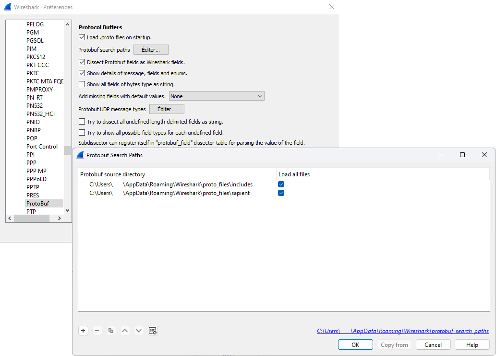

# SapientWireshark
Wireshark Lua Script to decode SAPIENT messages

## How to install the Lua Script and run it
In Wireshark, you can the Menu Help > About Wireshark > Folders. You need to check where personal lua plugins path is :

In the Menu Edit > Preferences > Protocols > protobuf, you need to add the folder where .proto files are. You also need to have the google .proto files on your computer.

At the end, you need to select any TCP/IP message, right-click and select Decode As... If you know the port where the SAPIENT message is transmitted, you can set it here.

